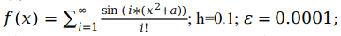
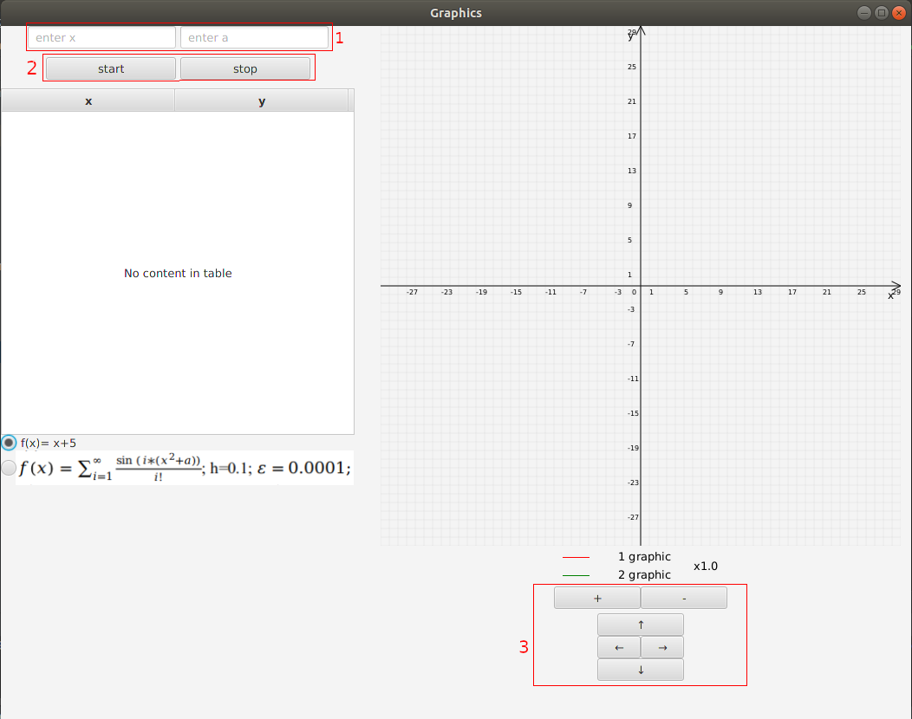

PPvIS-lab3-term4
================================

Введение
--------------------------------

Лабораторная работа №3 по ППвИС  
Вариант №2 студента гр.821703 Марковца В.С.

Краткое описание
--------------------------------

Разработанная программа рисует графики функций: 
1. f(x) = x + 5.
2. 

В левой части программы находятся таблица, кнопки запуска и остановки
 отрисовки и вычисления значений графиков, поля для ввода необходимых
  значений и кнопки для выбора графика. 
   В правой части находится компонент для рисования графиков, 
  кнопки масштаба и смещения, краткая информация о графиках. 

Функционал
--------------------------------

1. Группа 1 представляет собой два поля для ввода параметров второй функции, поля помеченны подсказками.
2. Группа 2 представляет собой кнопки управления программой:
    * кнопка "start" запускает вычисление точек и отрисовку выбранного графика
    * кнопка "stop" останавливает вычисление и отрисовку и меняет текст кнопок "start" и "stop" на "continue"  и "clear" соответсвенно.
    * повторное нажатие на кнопку "stop", когда ее текст "clear", очистит таблицу значений и компонент рисования графиков.
3. В таблице отображаются, вычисленные значения функций.
4. Ниже расположена группа выбора функций
5. В правой части расположен компонент для рисования графиков.
6. Группа 3 управляет компонентом:
   * кнопка "+" увеличивает масштаб в 1.25 раза.
   * кнопка " - " уменьшает масштаб в 0.8 раз.
   * кнопки "←", "→", "↑", "↓" двигают график вправо, влево, вверх, винз соответственно.
7. Изменить масштаб так же можно зажав клавишу "ctrl" и прокрутить колёсико мыши над компонентом для рисования.
8. Сдвинуть график так же можно зажав левую клавишу мыши на компоненте для рисования и потянуть в нужную сторону.